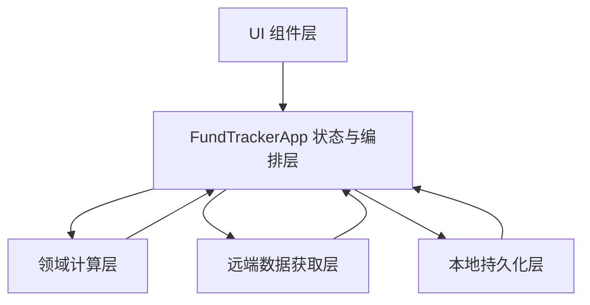
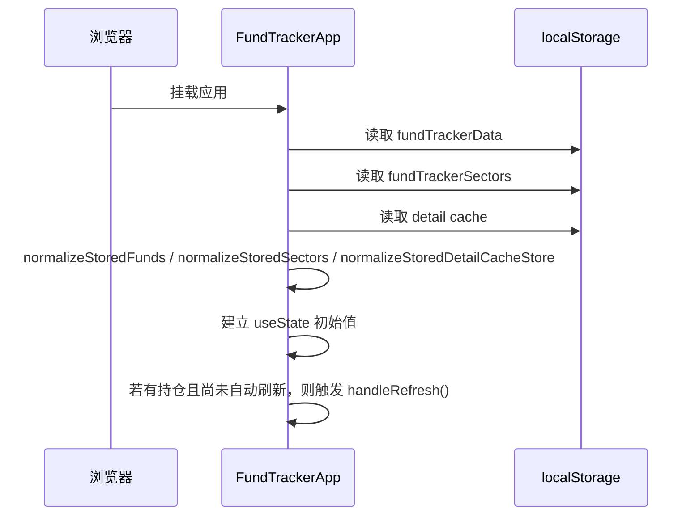
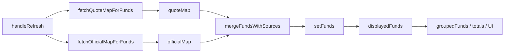
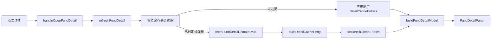

# 整体架构与数据流

## 1. 架构概览

项目的运行时可以概括为 4 层：



对应关系如下：

- UI 组件层
  - `Modal`
  - `FundDetailPanel`
  - `DetailMetricCard`
  - `DetailStatRow`
  - 主表格和各类弹窗表单
- 状态与编排层
  - `FundTrackerApp`
  - 负责所有 `useState`、`useMemo`、`useEffect` 和交互处理函数
- 领域计算层
  - `buildFundSnapshot`
  - `buildDisplayedFund`
  - `buildFundDetailModel`
  - `applyTradeToFund`
  - 一系列 normalize / parse / derive 函数
- 远端数据获取层
  - 天天基金估值 JSONP
  - 东财官方净值 JSONP
  - 东财官方历史净值 JSONP
- 本地持久化层
  - `localStorage['fundTrackerData']`
  - `localStorage['fundTrackerSectors']`
  - `localStorage[DETAIL_CACHE_STORAGE_KEY]`

## 2. 状态结构

`FundTrackerApp` 中的状态可以分成 3 类。

### 2.1 核心业务状态

- `funds`
  - 基金持仓源数据
  - 列表、详情、刷新、交易同步都依赖它
- `sectors`
  - 分组顺序与名称集合
- `detailCacheEntries`
  - 基金详情缓存集合，以基金代码为 key

### 2.2 页面控制状态

- `isRefreshing`
- `lastUpdateTime`
- `collapsedGroups`
- `selectedFund`
- `detailView`
- `detailRequestStates`
- `modals`

这些状态控制页面刷新中标识、详情面板显示、分组折叠、弹窗开关与请求反馈。

### 2.3 表单状态

- `newGroupName`
- `fundForm`
- `fundLookup`
- `syncForm`
- `editForm`

这些状态只服务于当前弹窗，不会直接持久化。

## 3. 派生数据

项目大量使用 `useMemo` 生成派生结果，以减少重复计算并保持数据口径一致。

### 3.1 列表派生

- `displayedFunds`
  - 由 `funds` 推导出的“列表展示口径”基金对象
  - 每个基金会经过 `buildDisplayedFund()`
- `latestOfficialDate`
  - 当前持仓中最新的官方净值日期
- `valuationSourceSummary`
  - 统计官方净值、盘中估值、最新净值和回退快照的数量

### 3.2 汇总与分组派生

- `groupedFunds`
  - 按 `sector` 分组后的基金集合
- `totalDailyProfit`
- `totalAmount`
- `totalProfit`
- `orderedGroups`
  - 保持分组展示顺序与 `sectors` 一致

### 3.3 详情页派生

- `activeDetailSourceFund`
  - 当前选中基金在源数据中的对象
- `activeDetailDisplayedFund`
  - 当前选中基金在列表口径下的展示对象
- `activeDetailEntry`
  - 当前详情缓存对象
- `activeDetailModel`
  - 通过 `buildFundDetailModel()` 组合出来的详情页模型

## 4. 启动与恢复流程

应用加载时的流程如下：



关键点：

- 启动时优先使用本地缓存，确保页面可立即渲染
- 首次挂载后如果有持仓，会自动触发一次刷新
- 刷新并不会清空旧数据，而是尽量在现有数据基础上补全最新值

## 5. 列表刷新数据流

列表刷新是最核心的业务流程之一：



说明：

- `fetchQuoteMapForFunds()` 逐只获取天天基金估值
- `fetchOfficialMapForFunds()` 逐只获取东财最近两条官方净值
- `mergeFundsWithSources()` 负责把远端结果回填进当前基金数组
- 刷新结束后，列表、汇总、分组和详情入口会一起更新

## 6. 基金新增数据流

新增持仓流程不是直接保存用户输入，而是先用远端估值补齐基金信息：

```text
输入基金代码
  -> 自动触发基金查询
  -> 成功返回 quote
  -> 用户填写分组/持有金额/持有收益/可选份额
  -> handleAddFund()
  -> reconcileFundWithQuote()
  -> 尝试补官方净值 applyOfficialNetValueToFund()
  -> 若未手填份额，则 alignFundSharesToDisplayedAmount()
  -> setFunds()
```

这意味着：

- 基金名称主要依赖远端查询结果
- 成本金额由“持有金额 - 持有收益”反推
- 如果用户没有填写份额，系统会按当前可用净值反推出份额

## 7. 交易同步数据流

交易同步基于“最新可用净值”更新份额与成本，而不是重算历史。

```text
输入基金代码 + 交易类型 + 金额
  -> handleSyncTrade()
  -> 尝试获取最新 quote
  -> applyTradeToFund()
  -> 更新 shares / costAmount / holdingStartDate
  -> buildFundSnapshot()
  -> setFunds()
```

不同交易类型的含义：

- 买入
  - 增加份额
  - 增加成本
- 卖出
  - 减少份额
  - 按卖出份额占比减少成本
- 分红
  - 不变更份额
  - 直接减少成本

## 8. 详情页数据流

详情页的数据与列表页有意分层，避免混淆口径。



详情页刻意区分两类信息：

- 列表口径
  - 持有金额
  - 当日收益
- 官方历史口径
  - 昨日收益
  - 今年涨幅
  - 近 1 年 / 近 3 年表现

这样做的目的是避免把“盘中估值”和“官方净值历史”混在一个字段里。

## 9. 本地缓存策略

### 9.1 持仓与分组

- `funds` 变化时立即写回 `fundTrackerData`
- `sectors` 变化时立即写回 `fundTrackerSectors`

### 9.2 详情缓存

详情缓存由 `fundDetails.js` 管理：

- 带 `version`
- 带 `fetchedAt`
- 带 `TTL`
- 在读取时会做 normalize

缓存策略特点：

- 详情缓存不会阻塞主列表刷新
- 详情缓存过期时才重新拉取
- 如果远端刷新失败，但本地有旧缓存，详情页仍可回退展示

## 10. 依赖方向

这个项目的依赖方向非常集中：

```text
main.jsx
  -> App.jsx
    -> fundDetails.js

App.jsx
  -> React hooks
  -> lucide-react
  -> sortablejs
  -> 浏览器 API (localStorage, DOMParser, script 注入, window callback)
```

这里没有循环依赖，也没有复杂目录级耦合；主要问题不是依赖混乱，而是 `App.jsx` 责任过重。

## 11. 当前架构优点与代价

### 优点

- 项目体量小，入口清晰
- 所有主流程在一个文件内，短期上手成本低
- 列表口径与详情口径区分明确
- 纯前端部署简单，不依赖后端

### 代价

- `App.jsx` 过长，维护成本会随需求增长迅速上升
- 服务请求、领域计算、UI 渲染耦合在一起
- 缺少显式类型约束，重构风险较高
- 缺少测试，核心计算函数回归风险偏高
